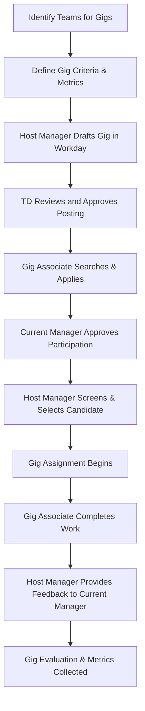

# Gig Assignment Process Map

This document describes the step-by-step process for managing gig assignments using Workday Career Hub's Flex Team module.

## Roles

- **Business Unit Development Team (BUD)** – oversees gigs in the business unit, defines targets and metrics, provides governance.
- **Manager Hosting the Gig Assignment (Host Manager)** – posts and manages the gig, mentors the Gig Associate, provides feedback.
- **Gig Associate** – employee participating in the gig.
- **Current Manager of Gig Associate (Current Manager)** – approves participation and manages workload.
- **Talent Development Team (TD)** – governs the overall program, reviews gig postings, and assists with placement.

## Process Overview



## Detailed Steps by Role

### Business Unit Development Team
1. Identify teams within the business unit that can benefit from gig assignments.
2. Set metrics such as target number of gigs, desired skill development, and timeline.
3. Provide guidance to host managers on appropriate gig types.
4. Monitor gig activity and collect metrics after assignments end.

### Manager Hosting the Gig Assignment
1. Determine the work suitable for a gig and draft the assignment in Workday Career Hub.
2. Submit the gig to the Talent Development Team for review.
3. Once approved, review applications from gig associates.
4. Select a candidate and coordinate start dates and expectations.
5. Provide mentorship and oversee deliverables throughout the gig.
6. Give feedback to the gig associate and their current manager at the end of the assignment.

### Gig Associate
1. Search for available gig assignments in Workday Career Hub.
2. Discuss interest with the current manager and secure approval.
3. Apply for the gig and participate in screening or interviews as needed.
4. Complete the gig work, adhering to goals and timelines set by the host manager.
5. Provide feedback on the experience once the gig concludes.

### Current Manager of Gig Associate
1. Review the associate's workload and determine whether participation is feasible.
2. Approve or decline the associate's application in Workday Career Hub.
3. Adjust team objectives to accommodate the associate's temporary responsibilities.
4. Receive feedback from the host manager and incorporate it into performance evaluations.

### Talent Development Team
1. Define policies, eligibility requirements, and approval workflow for gigs.
2. Review gig postings from host managers for appropriateness and alignment with criteria.
3. Support host managers in screening candidates and ensure fairness in selection.
4. Track overall program metrics and provide reports to leadership.
5. Continuously refine guidelines based on feedback and results.

## Completion and Evaluation
1. At the end of each gig assignment, the host manager submits an evaluation in Workday Career Hub.
2. The current manager and gig associate complete corresponding evaluations.
3. BUD collects data across gigs to measure impact and inform future opportunities.
4. TD aggregates metrics and ensures compliance with policies.

```
